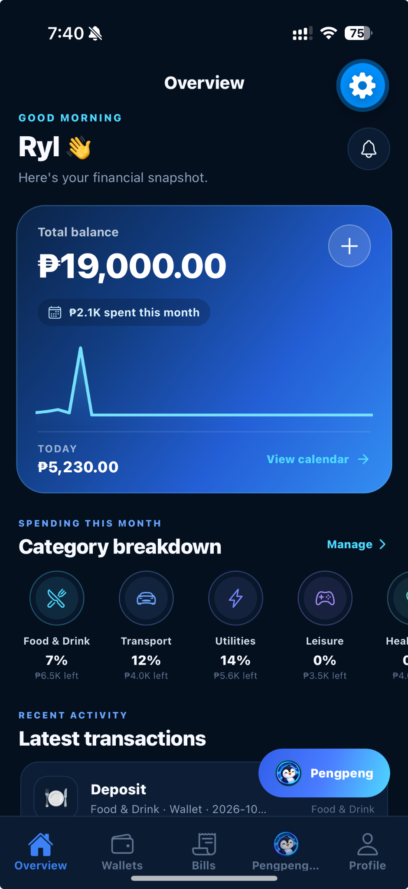
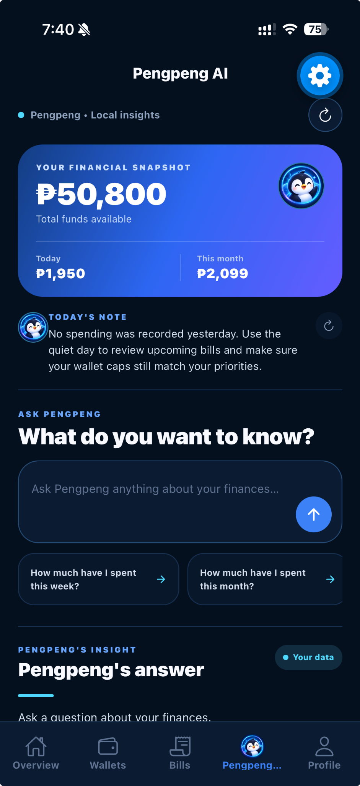
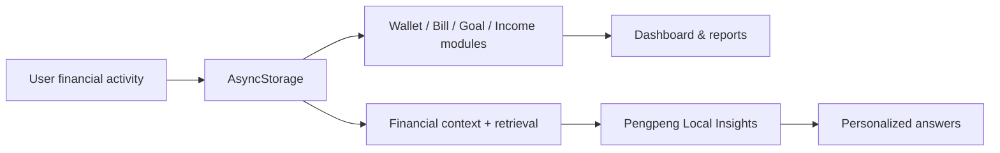

<p align="center">
  
</p>

<h1 align="center">Pengpeng — The Smart AI Expense Tracker</h1>

<p align="center">
  A personalized, local-first finance companion built with React Native and Expo.
</p>

<p align="center">
  Track money • Organize wallets • Manage bills • Build savings goals • Understand spending patterns
</p>

---

## About Pengpeng

**Pengpeng** is a mobile personal-finance application designed to do more than record expenses. It brings balances, wallets, bills, subscriptions, payday income, savings goals, reports, and personalized financial insights into one connected experience.

The app is centered around **Pengpeng**, a friendly penguin assistant that helps make financial information easier to understand. The current build runs in **Local Insights** mode: Pengpeng analyzes financial data stored on the device and uses retrieval, calculations, and spending-pattern logic to answer supported questions without requiring a cloud AI service.

## App preview

<table>
  <tr>
    <td align="center"><strong>Overview</strong></td>
    <td align="center"><strong>Pengpeng AI</strong></td>
  </tr>
  <tr>
    <td></td>
    <td></td>
  </tr>
</table>

> These are real device screenshots from the working Expo build. Additional screenshots for Wallets, Bills, Profile/Goals, and App Tour can be added to `docs/screenshots/`.

## Core features

| Area | What Pengpeng does |
| --- | --- |
| **Overview** | Shows Total Balance, monthly spending, Today spending, category budget progress, calendar activity, and recent transactions. |
| **Wallets** | Create custom wallets, deposit, withdraw, transfer funds, set monthly caps, review history, and add wallet-level expenses. |
| **Auto Split** | Distribute payday income across wallets using percentage-based allocations. |
| **Bills & Subscriptions** | Track due dates, payment sources, payment history, Autopay/Pause settings, filters, and reminders. |
| **Savings Goals** | Create goals, define targets and timelines, confirm contributions, and monitor progress. |
| **Pengpeng AI** | Reads saved financial context to provide local summaries, quick answers, spending-pattern insights, and budget-risk observations. |
| **Reports** | Generate monthly financial reports with PDF export and sharing. |
| **Notifications** | Support reminders related to bills, payday income, and budget activity. |
| **Onboarding & Tour** | First install follows Splash → App Tour → Profile Onboarding → Home. Later opens go Splash → Home. |

## First-launch experience

```text
Fresh install
    ↓
Pengpeng splash
    ↓
Tap to continue
    ↓
App Tour
    ↓
Profile Onboarding
    ↓
Home
```

After the initial setup:

```text
Reopen app
    ↓
Pengpeng splash
    ↓
Tap to continue
    ↓
Home
```

The App Tour remains available from Profile for users who want to revisit the walkthrough.

## Pengpeng Local Insights

Pengpeng can use financial data already saved in the application, including:

- Total Balance and wallet balances
- wallet expense history
- monthly wallet caps and budget usage
- bills, subscriptions, and payment history
- upcoming due dates
- payday / recurring income settings
- Auto Split percentages
- savings goals and contribution schedules
- transaction and ledger history
- user-stated spending preferences
- derived spending patterns and budget risk

The quick-question buttons are examples, not hard-coded data sources. The app rebuilds the relevant financial context from local storage when generating supported insights.

### Optional generative AI

The current portfolio build does **not require a remote AI backend**. A secure server-side integration can be added later for unrestricted open-ended generative responses.

See [`OPTIONAL_AI_BACKEND.md`](./OPTIONAL_AI_BACKEND.md) for the intended architecture and security requirements.

## Architecture



## Tech stack

- **React Native**
- **Expo SDK 57**
- **JavaScript**
- **React Navigation**
- **AsyncStorage**
- **React Native SVG**
- **React Native Calendars**
- **Expo Notifications**
- **Expo Print**
- **Expo Sharing**
- **Expo Image Picker**
- Local retrieval / RAG-style financial context
- Data analytics and spending-pattern logic

## Project structure

```text
Pengpeng/
├── App.js
├── app.json
├── assets/
│   └── branding/
│       ├── pengpeng-app-icon.png
│       ├── pengpeng-avatar.png
│       └── pengpeng-splash.png
├── docs/
│   └── screenshots/
├── src/
│   ├── components/
│   ├── constants/
│   ├── screens/
│   ├── services/
│   ├── theme/
│   └── utils/
├── .env.example
├── package.json
└── README.md
```

## Run locally

### Requirements

- Node.js 22+
- npm
- Expo Go, Android emulator, or iOS simulator/device

### Installation

```bash
git clone https://github.com/honghaei/pengpeng-ai-expense-tracker.git
cd pengpeng-ai-expense-tracker
npm install
```

### Start the project

```bash
npx expo start -c
```

Then scan the QR code with Expo Go or launch an emulator/simulator.

## Useful commands

```bash
npm start
npm run android
npm run ios
npm run web
npm run doctor
npm run export:android
```

## Data and privacy

The core application stores financial data locally with **AsyncStorage**.

- no provider API key is embedded in the mobile client
- local financial features do not require a cloud AI service
- `.env` is excluded from Git
- any future remote AI provider key should remain server-side

## Development status

**Portfolio-ready / actively refinable**

The following flows have been manually tested in Expo Go:

- branded splash and Tap to Continue
- first-run App Tour and Profile Onboarding
- persistent user profile
- Today spending updates
- wallet creation and wallet transactions
- deposit, withdrawal, and wallet transfer
- bills and subscription payments
- Pengpeng quick questions and free-text input
- savings goals and reports
- local data persistence after app restart

## Planned refinements

- add final clean-device screenshots for all major screens
- package a standalone development/preview build
- optionally connect a secure generative-AI backend
- continue refining spending-pattern recommendations

---

<p align="center">
  Built as a React Native personal-finance portfolio project.
</p>
